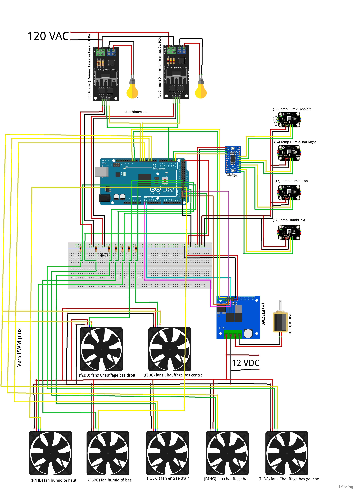

# Arduino-Based Incubator Environmental Control System

## System Overview

This Arduino-based incubator environmental control system maintains precise temperature and humidity conditions across three distinct zones (TOP, BOT, and EXT) within a repurposed refrigerator housing, optimizing insulation and structural stability. Utilizing AHT20 sensors, PWM-controlled fans, dimmers and 100w incandescent lightbulbs. The system features advanced error handling, non-blocking operation, and biological process optimization.

### Wiring plan



**Key Features:**

- Multi-zone climate control
- Redundant sensor systems
- Adaptive control algorithms
- Real-time monitoring
- Automatic failure recovery

---

# 1. System Architecture

## 1.1 Hardware Infrastructure

### 1.1.1 Microcontroller Configuration

The system is built on the **Arduino Mega 2560** platform, chosen for its extensive I/O capabilities and multiple hardware timers.

**Specifications:**

- **Processor**: ATmega2560 @ 16 MHz
- **Memory**: 256KB Flash, 8KB SRAM, 4KB EEPROM
- **Digital I/O**: 54 pins (15 PWM capable)
- **Analog Inputs**: 16 channels (10-bit resolution)
- **Hardware Timers**: 6 timers for precise PWM control

**Timer Allocation:**

```
Timer 0: Arduino millis() and delay() functions
Timer 1: Available for future expansion
Timer 2: Available for future expansion
Timer 3: PWM for pins 2, 3, 5 (fan control)
Timer 4: Available for future expansion
Timer 5: PWM for pins 44, 45 (fan control)
```

### 1.1.2 I2C Bus Architecture

The I2C communication backbone enables multiple identical sensors on a single bus through multiplexing.

**Physical Connection:**

```
Arduino Mega 2560
├── Pin 20 (SDA) ──┐
├── Pin 21 (SCL) ──┤
                   │
                   └─→ TCA9548A I2C Multiplexer (Address: 0x70)
                       ├── Channel 0: [Unused]
                       ├── Channel 1: [Unused]
                       ├── Channel 2: EXT Sensor (External/exterior)
                       ├── Channel 3: TOP Sensor (Upper Chamber)
                       ├── Channel 4: BOT_D Sensor (Bottom Door-side)
                       ├── Channel 5: BOT_G Sensor (Bottom Glass-side)
                       ├── Channel 6: [Reserved for expansion]
                       └── Channel 7: [Reserved for expansion]
```

**I2C Communication Parameters:**

- **Bus Speed**: 100 kHz (standard mode)
- **Pull-up Resistors**: 4.7kΩ on SDA and SCL
- **Multiplexer Control**: Single-byte channel selection
- **Error Detection**: ACK/NACK monitoring

### 1.1.3 Sensor Specifications (AHT20)

The AHT20 is a calibrated digital temperature and humidity sensor with I2C interface.

**Technical Specifications:**

| Parameter              | Value            |
| ---------------------- | ---------------- |
| Temperature Range      | -40°C to +85°C   |
| Temperature Accuracy   | ±0.3°C           |
| Temperature Resolution | 0.01°C           |
| Humidity Range         | 0-100% RH        |
| Humidity Accuracy      | ±2% RH           |
| Humidity Resolution    | 0.024% RH        |
| Response Time          | 5-30 seconds     |
| Supply Voltage         | 2.0-5.5V         |
| Supply Current         | 23µA (typical)   |
| Communication          | I2C (max 400kHz) |

**Sensor Placement Rationale:**

- **EXT**: Monitors exterior conditions for compensation algorithms
- **TOP**: Upper chamber (hatcher), where warm air accumulates
- **BOT_D**: Bottom chamber (setter), where warm air accumulates on the right
- **BOT_G**: Bottom chamber (setter), where warm air accumulates on the left

## 1.2 Fan System Detailed Analysis

### 1.2.1 Fan Distribution and Purpose

The seven-fan system creates controlled airflow patterns for optimal environmental conditions.

**Fan Configuration Table:**

| Fan ID | Location       | Pin | Function         | Control Strategy     |
| ------ | -------------- | --- | ---------------- | -------------------- |
| F1BG   | Bottom Chamber | 2   | Circulation      | Temperature-based    |
| F2BD   | Bottom Chamber | 2   | Circulation      | Temperature-based    |
| F3BC   | Bottom Chamber | 2   | Circulation      | Temperature-based    |
| F4HG   | Top Chamber    | 3   | Circulation      | Temperature-based    |
| F5EXT  | Exterior       | 5   | Air exchange     | Temp/Humidity hybrid |
| F6BC   | Bottom Chamber | 45  | Humidity control | Humidity-based       |
| F7HD   | Top Chamber    | 44  | Humidity control | Humidity-based       |

**Shared PWM Design:** F1BG, F2BD, and F3BC share pin 2 to ensure synchronized operation

### 1.2.2 PWM Control Resolution

The system uses 8-bit PWM for fan speed control, providing 256 discrete speed levels.

**Speed Mapping:**

```cpp
// Percentage to PWM conversion
uint8_t percentageToPWM(uint8_t percentage) {
    return map(percentage, 0, 100, 0, 255);
}
```

**Predefined Speed Levels:**

| Level    | Percentage | PWM Value | Use Case                    |
| -------- | ---------- | --------- | --------------------------- |
| OFF      | 0%         | 0         | No airflow needed           |
| VERY_LOW | 25%        | 64        | Minimal circulation         |
| LOW      | 50%        | 128       | Gentle airflow              |
| MEDIUM   | 75%        | 191       | Normal operation            |
| HIGH     | 100%       | 255       | Maximum cooling/circulation |

**PWM Frequency:**

- Default: 490 Hz (Timer 3 and Timer 5)
- Audible noise: Minimal at this frequency

### 1.2.3 Tachometer Feedback System

Each fan provides RPM feedback through a tachometer output, enabling closed-loop monitoring.

**Tachometer Signal Characteristics:**

- **Type**: Open-collector output (requires pull-up resistor)
	- The pull-up resistor prevents a pin from being "floating," meaning it's neither high nor low, which can lead to unpredictable behavior.
- **Pulses per Revolution**: 2 (standard for 4-pole motors)
- **Signal Level**: 0-5V square wave

**Non-Blocking Pulse Measurement:**

```cpp
struct PulseData {
    unsigned long startTime = 0;  // Microsecond timestamp
    unsigned long duration = 0;   // Pulse width in microseconds
    bool pulseDetected = false;   // State tracking
};

// RPM Calculation
RPM = 60,000,000 / (pulse_duration × 4)
// Where: 60,000,000 = microseconds per minute
//        4 = 2 pulses/rev × 2 (for full period)
```

**Validation Ranges:**

- Minimum pulse: 1,000 µs (60,000 RPM - unrealistic, filtered)
- Maximum pulse: 1,000,000 µs (60 RPM - stall detection)

## 1.3 Heating System Architecture

### 1.3.1 Dimmer Control Implementation

The heating system uses AC phase control through TRIAC dimmers for precise temperature regulation.

**Hardware Components:**

- **Zero-Cross Detector**: Pin 18 (interrupt-capable)
- **TRIAC Driver (TOP)**: Pin 6
- **TRIAC Driver (BOT)**: Pin 7
- **Library**: `dimmable_light_linearized.h`

**Power Control Levels:**

| Setting | Power | Purpose                    |
| ------- | ----- | -------------------------- |
| OFF     | 0%    | No heating required        |
| LOW     | 40%   | Maintenance heating        |
| MEDIUM  | 60%   | [Unused in current config] |
| HIGH    | 80%   | Rapid temperature recovery |

**Safety Limitation:** Maximum 80% power prevents TRIAC overheating and extends the incandescent light bulb (100w) life.

### 1.3.2 AC Phase Control

The dimmer implements phase control for power regulation.

**Operating Principle:**

1. **Zero-Cross Detection**: Identifies AC waveform crossing zero volts
2. **Phase Delay**: Calculates delay based on desired power
3. **TRIAC Firing**: Triggers conduction at calculated point
4. **Power Delivery**: Earlier firing = more power

**Timing Calculations:**

```
AC Period = 16.67ms (60Hz) or 20ms (50Hz)
Half Period = 8.33ms (60Hz) or 10ms (50Hz)
Phase Angle = (1 - Power%) × Half Period
```

**Linear Compensation:** The library compensates for non-linear power delivery:

- Raw phase control: Power ∝ (Phase Angle)²
- Linearized output: Power ∝ Brightness setting

# 2. Environmental Control Algorithms

## 2.1 Temperature Control

### 2.1.1 TOP Chamber (Hatcher) Temperature Logic

The TOP chamber maintains optimal incubation temperature through coordinated heater and fan control.

**Temperature Zones and Responses:**

| Zone     | Temperature Range | Heater Action | Fan F4HG Action | Rationale                                     |
| -------- | ----------------- | ------------- | --------------- | --------------------------------------------- |
| VERY_LOW | < 36.0°C          | 80% Power     | 100% Speed      | Rapid warming with maximum circulation        |
| LOW      | 36.0-37.50°C      | 40% Power     | 75% Speed       | Gentle warming approaching target             |
| OPTIMAL  | 37.50-37.60°C     | 0% Power      | 50% Speed       | Maintain with circulation only                |
| HIGH     | > 37.60°C         | 0% Power      | 100% Speed      | Active cooling via air exchange with exterior |

**Control Logic Visualization:**

```
Temperature (°C)
    │
<36.0├─── VERY_LOW ─── Heater: 80%, Fan: 100%
    │
37.50├─── LOW ─────── Heater: 40%, Fan: 75%
    │
37.60├─── OPTIMAL ─── Heater: 0%, Fan: 50%
    │
  >  ├─── HIGH ────── Heater: 0%, Fan: 100%
    │
```

### 2.1.2 BOTTOM Chamber (Setter) Temperature Logic

The BOTTOM chamber uses averaged readings from two sensors to compensate for sensor inaccuracies.

**Dual Sensor Averaging:**

```cpp
float botTemperatureAvg = (botSensorData.temperatureD + botSensorData.temperatureG) / 2;
```

Averaging prevents control bias from single-point measurement

**Temperature Zones and Responses:**

| Zone     | Temperature Range | Heater Action | Fans F1-F3 Action | Notes             |
| -------- | ----------------- | ------------- | ----------------- | ----------------- |
| VERY_LOW | < 36.0°C          | 80% Power     | 100% Speed        | Emergency heating |
| LOW      | 36.0-37.54°C      | 40% Power     | 75% Speed         | Normal warming    |
| OPTIMAL  | 37.54-37.68°C     | 0% Power      | 50% Speed         | Target achieved   |
| HIGH     | > 37.68°C         | 0% Power      | 100% Speed        | Cooling required  |

### 2.1.3 External Temperature Compensation Algorithm

The system adapts to exterior conditions by modifying bottom chamber heater setpoints.

**Compensation Logic:**

```cpp
if (extTemperature < 18.0°C) {  // VERY_LOW_TEMP_EXT
    // Increase all bottom dimmer settings by 10%
    adjustedDimmerLow = DIMMER_LOW + 10;    // 40% → 50%
    adjustedDimmerHigh = DIMMER_HIGH + 10;  // 80% → 90%
} else if (extTemperature > 22.0°C) {  // LOW_TEMP_EXT
    // Decrease all bottom dimmer settings by 10%
    adjustedDimmerLow = max(0, DIMMER_LOW - 10);   // 40% → 30%
    adjustedDimmerHigh = max(0, DIMMER_HIGH - 10); // 80% → 70%
}
```

**Rationale:**

- **Cold exterior (<18°C)**: Increased heating to compensate for cool air coming from the exterior
- **Warm exterior (>22°C)**: Reduced heating to compensate for warm air coming from the exterior
- **Neutral Zone (18-22°C)**: Standard control parameters

## 2.2 Humidity Control

### 2.2.1 TOP Chamber Humidity Management

The TOP chamber requires higher humidity for hatching.

**Humidity Control Matrix:**

| State    | RH Range | Fan F7HD | Strategy                 |
| -------- | -------- | -------- | ------------------------ |
| VERY_LOW | < 55%    | 100%     | Maximum humidification   |
| LOW      | 55-62%   | 100%     | Active humidification    |
| MEDIUM   | 62-68%   | 50%      | Maintenance mode         |
| HIGH     | > 68%    | 0%       | Natural dehumidification |

**Humidity Source:**

- Water pan and fan
- Variations of fan speeds manage evaporation rate by blowing air on the water pan.

### 2.2.2 BOTTOM Chamber Humidity Management

The BOTTOM chamber maintains lower humidity for setting.

**Humidity Control Matrix:**

| State    | RH Range | Fan F6BC | Purpose                 |
| -------- | -------- | -------- | ----------------------- |
| VERY_LOW | < 40%    | 100%     | Prevent desiccation     |
| LOW      | 40-45%   | 75%      | Increase moisture       |
| MEDIUM   | 45-48%   | 50%      | Maintain balance        |
| HIGH     | > 52%    | 0%       | Allow natural reduction |

### 2.2.3 Humidity Override Mechanism

Critical humidity levels trigger emergency ventilation regardless of temperature.

**Override Implementation:**

```cpp
// In adjustFanAndDimmerForExt()
if (botHumidityAvg > 55.0%) {  // HIGH_HUMIDITY_BOT threshold
    analogWrite(PWM_F5EXT, percentageToPWM(FAN_HIGH));  // Force 100%
    // Message: "Fan F5EXT: High Speed (EXT_SENSOR override - Bot Humidity > 55.0%)"
}
```

**Override Cascade:**

1. Bottom humidity exceeds 55%
2. F5EXT forced to 100% (overrides temperature control)
3. Fresh, dry air exchanges with humid internal air
4. Continues until humidity drops below threshold

## 2.3 External Air Exchange Logic

### 2.3.1 Normal Operation

The external fan (F5EXT) operates on a hierarchical decision tree.

**Decision Priority (Highest to Lowest):**

```
1. IF (BOT_HUMIDITY > 55%):
      F5EXT = 100%  [Humidity Override]
      
2. ELSE IF (EXT_TEMP > 36.8°C):
      F5EXT = 100%  [Active Cooling]
      
3. ELSE:
      F5EXT = 25%   [Baseline Ventilation]
```

**Operational Modes:**

| Mode                       | Condition            | Fan Speed | Purpose                         |
| -------------------------- | -------------------- | --------- | ------------------------------- |
| Emergency Dehumidification | Bot RH > 55%         | 100%      | Moisture removal                |
| Active Cooling             | Ext Temp > 36.8°C    | 100%      | Cooling of electronic enclosure |
| Baseline Ventilation       | All other conditions | 25%       | Gas exchange                    |

### 2.3.2 Air Quality Management

Continuous baseline ventilation ensures biological viability.

**Gas Exchange Requirements:**

- **O₂ Supply**: Embryonic respiration consumes oxygen
- **CO₂ Removal**: Metabolic waste product must be expelled
- **VOC Dilution**: Volatile organic compounds from biological processes

# 3. Sensor Reading and Data Processing

## 3.1 Timing Architecture

### 3.1.1 Reading Cycle Timeline

The sensor reading process follows a deterministic schedule to ensure predictable system behavior.

**Complete Cycle Breakdown:**

```
Time (ms)    Event                           Duration    Cumulative
─────────────────────────────────────────────────────────────────
0            Cycle Start                     -           0ms
0-500        Read EXT sensor (Channel 2)     500ms       500ms
500-1000     Read TOP sensor (Channel 3)     500ms       1000ms
1000-1500    Read BOT_D sensor (Channel 4)   500ms       1500ms
1500-2000    Read BOT_G sensor (Channel 5)   500ms       2000ms
2000-2100    Calculate averages              100ms       2100ms
2100-2200    Adjust controls                 100ms       2200ms
2200-2300    Update displays                 100ms       2300ms
2300-3000    Idle time                       700ms       3000ms
3000         Next cycle begins               -           -
```

**Timing Guarantees:**

- Maximum sensor read time: 500ms (includes retries)
- Control update latency: <100ms after sensor read
- Worst-case cycle time: 3000ms
- Watchdog margin: 5000ms (8000ms timeout - 3000ms cycle)

### 3.1.2 Non-Blocking Implementation

The system uses state machines to prevent blocking operations.

**Main Loop State Machine:**

```cpp
// Sensor reading states
static bool readingInProgress = false;
static int sensorIndex = 0;

// Cycle trigger
if (currentMillis - previousSensorMillis >= readInterval && !readingInProgress) {
    previousSensorMillis = currentMillis;
    sensorIndex = 0;
    readingInProgress = true;
}

// Sensor reading progression
if (readingInProgress && currentMillis - sensorDelayMillis >= sensorDelayInterval) {
    // Read current sensor
    // Increment sensorIndex
    // Set readingInProgress = false when complete
}
```

**Benefits:**

- No delay() calls that would block execution
- Continuous fan RPM monitoring
- Responsive to emergency conditions
- Prevents watchdog timeouts

## 3.2 Data Validation and Filtering

### 3.2.1 Validation Criteria

All sensor readings undergo validation before use.

**Validation Function:**

```cpp
bool isValidReading(float value, float minVal, float maxVal) {
    return !isnan(value) && value >= minVal && value <= maxVal;
}
```

**Range Limits:**

| Parameter   | Minimum | Maximum | Action if Invalid  |
| ----------- | ------- | ------- | ------------------ |
| Temperature | -40.0°C | +85.0°C | Use fallback value |
| Humidity    | 0.0%    | 100.0%  | Use fallback value |

**NaN Detection:**

- Caused by: Communication errors, sensor failure
- Response: Immediate fallback to calculated estimate

### 3.2.2 Moving Average Implementation

The system maintains 100-sample circular buffers to get an average of the last 100 sensors readings.

**Buffer Structure:**

```cpp
// Temperature arrays
float topTemperatures[100];
float botDTemperatures[100];
float botGTemperatures[100];

// Humidity arrays
float topHumidities[100];
float botDHumidities[100];
float botGHumidities[100];

// Circular index
int readingIndex = 0;
```

**Average Calculation:**

```cpp
float calculateAverage(float readings[], int n) {
    float sum = 0;
    for (int i = 0; i < n; i++) {
        sum += readings[i];
    }
    return sum / n;
}
```

**Filtering Performance:**

- **Sample Window**: 300 seconds (100 samples × 3 seconds)
- **Effective Resolution**: 0.03°C (from 0.3°C sensor accuracy)

## 3.3 Failure Management

### 3.3.1 Sensor Health Tracking

Each sensor maintains health statistics for reliability monitoring.

**Health Metrics:**

```cpp
struct SensorHealth {
    int successfulReads = 0;  // Cumulative success count
    int failedReads = 0;      // Cumulative failure count
};
```

**Failure Escalation:**

1. **Single Failure**: Retry up to 3 times
2. **Persistent Failure**: Increment failure counter
3. **Chronic Failure**: After 10 failures, disable sensor
4. **Recovery Check**: Every 60 seconds, attempt re-enable

**Health Status Display every 300 seconds (Serial Monitor):**

```
Sensor Health Status:
EXT - Successful Reads: 1200, Failed Reads: 2
TOP - Successful Reads: 1198, Failed Reads: 4
BOT_D - Successful Reads: 1201, Failed Reads: 1
BOT_G - Successful Reads: 1202, Failed Reads: 0
```

### 3.3.2 Fallback Strategy

Intelligent fallback values maintain system operation during sensor failures.

**Temperature Fallback Logic:**

```cpp
float getFallbackTemperature(int sensorIndex) {
    switch (sensorIndex) {
        case EXT:   return 25.0;  // Assume room temperature
        case TOP:   return botSensorData.temperatureD - 0.3;  // Thermal model
        case BOT_D: return botSensorData.temperatureG;  // Adjacent sensor
        case BOT_G: return botSensorData.temperatureD;  // Adjacent sensor
    }
}
```

**Humidity Fallback Logic:**

```cpp
float getFallbackHumidity(int sensorIndex) {
    switch (sensorIndex) {
        case EXT:   return 50.0;  // Assume moderate humidity
        case TOP:   return botSensorData.humidityD + 15.0;  // Evaporation model
        case BOT_D: return botSensorData.humidityG;  // Adjacent sensor
        case BOT_G: return botSensorData.humidityD;  // Adjacent sensor
    }
}
```

**Fallback Rationale:**

- **Thermal Stratification**: TOP is typically 0.3°C cooler than BOT
- **Humidity Gradient**: TOP is ~15% more humid due to hatching requirements
- **Adjacent Correlation**: BOT sensors typically within 0.1°C of each other

## 3.4 I2C Communication Robustness

### 3.4.1 Channel Selection State Machine

Multi-stage error handling ensures reliable multiplexer control.

**State Definitions:**

```
State 0: Idle - Ready to start new transmission
State 2: Retry - Previous attempt failed, waiting to retry
State 3: Bus Reset - Multiple failures, attempting recovery
```

**State Transitions:**

```
    ┌─────┐ Success  ┌─────┐
    │  0  ├─────────→│Done │
    │Idle │          └─────┘
    └──┬──┘
       │ Failure
       ▼
    ┌─────┐ Retry<3   ┌─────┐
    │  2  ├──────────→│ 0   │
    │Retry│           │Idle │
    └──┬──┘           └─────┘
       │ Retry≥3
       ▼
    ┌─────┐ Reset OK  ┌─────┐
    │  3  ├──────────→│ 0   │
    │Reset│           │Idle │
    └─────┘           └─────┘
```

**Timing Parameters:**

- Retry delay: 50ms
- Maximum retries: 3
- Bus reset duration: 100ms
- Total timeout: 250ms

### 3.4.2 Bus Recovery Mechanism

Hardware-level recovery clears stuck I2C devices.

**Recovery Sequence:**

```cpp
void resetI2CBus() {
    // 1. Take control of I2C pins
    pinMode(SDA_PIN, OUTPUT);
    pinMode(SCL_PIN, OUTPUT);
    
    // 2. Clock out stuck devices (9 pulses)
    for (int i = 0; i < 9; i++) {
        digitalWrite(SCL_PIN, HIGH);
        delayMicroseconds(5);
        digitalWrite(SCL_PIN, LOW);
        delayMicroseconds(5);
    }
    
    // 3. Generate STOP condition
    digitalWrite(SDA_PIN, LOW);   // SDA low
    delayMicroseconds(5);
    digitalWrite(SCL_PIN, HIGH);  // SCL high
    delayMicroseconds(5);
    digitalWrite(SDA_PIN, HIGH);  // SDA high (STOP)
    
    // 4. Return control to I2C hardware
    pinMode(SDA_PIN, INPUT);
    pinMode(SCL_PIN, INPUT);
    Wire.begin();
}
```

**Recovery Triggers:**

- 3 consecutive NAKs from multiplexer
- Wire.endTransmission() returns error
- Sensor initialization timeout

# 4. Control System Dynamics

Different subsystems operate at optimized update rates.

**Update Frequency Table:**

| Subsystem      | Frequency  | Period     | Priority |
| -------------- | ---------- | ---------- | -------- |
| Sensor Reading | 0.33 Hz    | 3 seconds  | High     |
| Control Output | 0.33 Hz    | 3 seconds  | High     |
| Fan RPM        | Continuous | ~1ms       | Low      |
| Actuator State | Continuous | <1ms       | Medium   |
| Health Check   | 0.017 Hz   | 60 seconds | Low      |
| Debug Print    | 0.011 Hz   | 90 seconds | Lowest   |

**Timing Hierarchy:**

1. **Critical Path**: Sensor → Control → Output (3.2 seconds)
2. **Background Tasks**: RPM monitoring (continuous)
3. **Maintenance**: Health checks (60 seconds)
4. **Diagnostics**: Debug output (90 seconds)

# 5. Advanced Features

## 5.1 Linear Actuator System

### 5.1.1 Movement Sequence

The actuator system provides programmable eggs rotation.

**Complete Sequence Timeline:**

| Phase                  | Duration   | Action            | Purpose                 |
| ---------------------- | ---------- | ----------------- | ----------------------- |
| Initial Retract        | 60 seconds | Full retraction   | Return to home position |
| Initial Stop           | 10 seconds | Hold position     | Stabilization           |
| Extension Cycle (×11)  |            |                   |                         |
| - Extend               | 3 seconds  | Forward movement  | Agitation               |
| - Stop                 | 13 minutes | Hold position     | Settling time           |
| Retraction Cycle (×11) |            |                   |                         |
| - Retract              | 3 seconds  | Backward movement | Return stroke           |
| - Stop                 | 13 minutes | Hold position     | Settling time           |
| System Reset           | Immediate  | Watchdog timeout  | Clean restart           |

**Total Cycle Duration:**

```
Initial: 60 + 10 = 70 seconds
Extensions: 11 × (3 + 780) = 8,613 seconds
Retractions: 11 × (3 + 780) = 8,613 seconds
Total: 17,296 seconds ≈ 4.8 hours
```

**Motor Control Logic:**

```cpp
void controlMotor(bool enable, int dir) {
    if (enable) {
        digitalWrite(R_PWM, dir == 1 ? HIGH : LOW);   // Forward
        digitalWrite(L_PWM, dir == -1 ? HIGH : LOW);  // Reverse
        digitalWrite(R_EN, HIGH);  // Enable right
        digitalWrite(L_EN, HIGH);  // Enable left
    } else {
        digitalWrite(R_EN, LOW);   // Disable all
        digitalWrite(L_EN, LOW);
        digitalWrite(R_PWM, LOW);
        digitalWrite(L_PWM, LOW);
    }
}
```

### 5.1.2 Purpose Analysis

The actuator system simulates natural incubation movements.

**Biological Rationale:**

1. **Prevents Adhesion**
    - Embryo can stick to membrane
    - Periodic movement prevents attachment
    - Critical during days 3-18 of incubation
    
2. **Uniform Development**
    - Redistributes nutrients in albumen
    - Prevents yolk stratification
    - Ensures even temperature distribution
    
3. **Gas Exchange**
    - Movement enhances air cell formation
    - Facilitates CO₂ removal from egg
    - Improves O₂ penetration
    
4. **Natural Simulation**
    - Mimics parent bird movements
    - 3-second duration = gentle repositioning

**Movement Profile:**

```
Position
    │     ┌─3s─┐     ┌─3s─┐
MAX ├─────┘    └──-──┘    └────-                              
    │ 13min     13min      13min
```

## 5.2 Watchdog Timer Implementation

### 5.2.1 Normal Operation

The watchdog prevents system lockup through automatic reset.

**Configuration:**

```cpp
// In setup()
wdt_enable(WDTO_8S);  // 8-second timeout

// Throughout loop()
wdt_reset();  // Called multiple times per cycle
```

**Reset Prevention Points:**

1. Start of main loop
2. After sensor reading
3. During long operations

**Timeout Scenarios:**

- I2C bus permanently locked
- Infinite loop in user code
- Hardware malfunction
- Stack overflow

### 5.2.2 Intentional Reset

The system uses watchdog for controlled restart after actuator sequence.

**Reset Implementation:**

```cpp
if (sequenceCount >= REPETITIONS) {
    // After last retraction
    wdt_enable(WDTO_15MS);  // 15ms timeout
    while (true) {
        // Intentional infinite loop
        // Watchdog will reset in 15ms
    }
}
```

**Reset Benefits:**

- Clears accumulated errors
- Resets memory allocation
- Re-initializes all peripherals
- Returns actuator to home
- Provides known starting state

**Reset Sequence:**

1. Watchdog expires (15ms)
2. Processor resets
3. Bootloader runs (2 seconds)
4. Setup() executes
5. Normal operation resumes

## 5.3 Debug and Monitoring

### 5.3.1 Cyclic Reporting

Debug output occurs every 30 sensor cycles (90 seconds).

**Serial Monitor Contents:**

```
=========================================
EXT - Temperature: 22.3 °C, Humidity: 45.2 %
TOP - Temperature: 37.52 °C, Humidity: 66.8 %
BOT-Av - Temperature: 37.58 °C, Humidity: 47.3 %

EXT: F5EXT: 1250 RPM
TOP: F4HG: 2100 RPM, F7HD: 0 RPM
BOT: F1BG: 1800 RPM, F2BD: 1850 RPM, F3BC: 1820 RPM, F6BC: 950 RPM

TOP Average 100 Temperature:   37.51 °C
BOT_D Average 100 Temperature: 37.56 °C
BOT_G Average 100 Temperature: 37.59 °C

TOP Average 100 Humidity:   66.5 %
BOT_D Average 100 Humidity: 46.8 %
BOT_G Average 100 Humidity: 47.8 %

Next Linear actuator sequence: 5 of 11 EXTENDING_SEQUENCE
=========================================

Sensor Health Status:
EXT - Successful Reads: 1200, Failed Reads: 2
TOP - Successful Reads: 1198, Failed Reads: 4
BOT_D - Successful Reads: 1201, Failed Reads: 1
BOT_G - Successful Reads: 1202, Failed Reads: 0
=========================================
```

### 5.3.2 Conditional Logging

Intelligent logging reduces serial bandwidth usage.

**shouldPrint() Logic:**

```cpp
bool shouldPrint() {
    return cycleCounter % PRINT_CYCLE_INTERVAL == 0;
}
// PRINT_CYCLE_INTERVAL = 30 cycles = 90 seconds
```

**Benefits:**

- Reduces processing overhead
- Prevents serial buffer overflow
- Maintains 115200 baud efficiency
- Allows real-time monitoring without flooding

# 6. System Integration and Real-World Behavior

## 6.1 Startup Sequence

The system follows a deterministic initialization sequence.

**Startup Timeline:**

| Time    | Phase            | Actions                   | Duration   |
| ------- | ---------------- | ------------------------- | ---------- |
| 0ms     | Power On         | Bootloader execution      | 2000ms     |
| 2000ms  | Setup Start      | Serial initialization     | 10ms       |
| 2010ms  | GPIO Config      | Pin modes, initial states | 50ms       |
| 2060ms  | Peripheral Init  | Dimmers, I2C, Watchdog    | 100ms      |
| 2160ms  | Sensor Discovery | Channel scan, AHT20 init  | 5000ms max |
| 7160ms  | Control Start    | First sensor read         | 3000ms     |
| 10160ms | Steady State     | Normal operation          | Continuous |

**Initialization Details:**

1. **GPIO Configuration**
    
    ```cpp
    // Outputs set to safe states
    All PWM pins → 0 (fans off)
    Heater pins → 0 (heaters off)
    Motor pins → 0 (actuator stopped)
    ```
    
2. **Sensor Discovery Process**
    
    ```cpp
    For each channel (2-5):
      - Select multiplexer channel
      - Attempt AHT20.begin()
      - 5-second timeout per sensor
      - Continue with available sensors
    ```
    
3. **Initial Control State**
    
    - All fans: 0% (will ramp up based on readings)
    - All heaters: 0% (safety first)
    - Actuator: Begin 60-second retraction to ensure actuator is completely retracted before starting sequence.

## 6.2 Steady-State Operation

### 6.2.1 24-Hour Profile Example

The system adapts to environmental changes.

| Time Period | External Conditions    | System Response                        |
| ----------- | ---------------------- | -------------------------------------- |
| 00:00-06:00 | Cool (15-18°C), Stable | Increased heating, minimal ventilation |
| 06:00-09:00 | Warming (18-22°C)      | Reduced heating, baseline ventilation  |
| 09:00-15:00 | Warm (22-30°C)         | Minimal heating, increased ventilation |
| 15:00-18:00 | Peak (28-35°C)         | No heating, maximum cooling efforts    |
| 18:00-21:00 | Cooling (25-20°C)      | Gradual heating increase               |
| 21:00-00:00 | Cool (20-15°C)         | Return to night settings               |

## 6.3 Failure Scenarios and Recovery

### 6.3.1 Sensor Failure Cascade

**Failure Progression:**

```
1. Single Sensor Failure
   ├── Use fallback value
   ├── Continue normal operation
   └── Log failure for diagnostics

2. Paired Sensor Failure (BOT_D + BOT_G)
   ├── Use TOP - 0.3°C for temperature
   ├── Use TOP - 15% for humidity
   └── Increase safety margins

3. Zone Failure (All BOT or TOP)
   ├── Use remaining zone data
   ├── Apply conservative estimates
   └── Alert via serial output

4. Total Sensor Failure
   ├── Use default values (25°C, 50% RH)
   ├── Run fans at 50%
   ├── Run heaters at 20%
   └── Safe mode operation
```

**Recovery Mechanisms:**

- Automatic retry every 60 seconds
- I2C bus reset on communication failure
- Sensor re-initialization attempts
- Gradual trust rebuilding after recovery

# 7. Biological Considerations

## 7.1 Incubation Requirements

### 7.1.1 Temperature Precision

Critical temperature ranges for successful incubation.

**Species-Specific Requirements:**

| Species | Optimal Range | Critical Limits | Duration |
| ------- | ------------- | --------------- | -------- |
| Chicken | 37.5-37.8°C   | 36.1-39.4°C     | 21 days  |
| Duck    | 37.5°C        | 36.0-39.0°C     | 28 days  |
| Quail   | 37.6-37.8°C   | 36.5-39.0°C     | 17 days  |
| Turkey  | 37.5-37.6°C   | 36.0-39.0°C     | 28 days  |

**Temperature Impact on Development:**

- **Too Low (<36°C)**: Delayed development, weakness
- **Optimal (37.5°C)**: Normal development rate
- **Too High (>39°C)**: Accelerated but abnormal development
- **Lethal (>40°C)**: Protein denaturation, death

### 7.1.2 Humidity Management

Moisture control for proper development.

**Humidity Requirements by Stage:**

| Incubation Stage | Days  | Target RH | Purpose                   |
| ---------------- | ----- | --------- | ------------------------- |
| Early            | 1-7   | 50-60%    | Prevent excess water loss |
| Middle           | 8-18  | 45-55%    | Controlled dehydration    |
| Late             | 19-21 | 65-75%    | Facilitate hatching       |

**Humidity Effects:**

- **Too Low (<40%)**: Excessive water loss, stuck chicks
- **Optimal (50-55%)**: Proper air cell development
- **Too High (>75%)**: Insufficient water loss, drowning

**Water Loss Targets:**

- Total loss: 12-15% of initial egg weight
- Daily rate: 0.5-0.7% of egg weight
- Monitored by candling